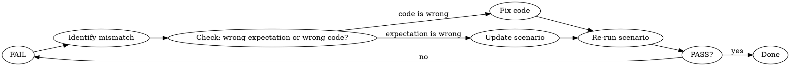

# CDP Verification Scenarios

## Overview

A structured workflow for executing verification scenarios through the **CDP + WebMCP bridge**. Each scenario defines: what to do, what to observe, and what counts as pass/fail.

**Core principle:** The agent observes UI state via CDP, compares it against the scenario's expected result, and makes an explicit pass/fail judgment — not just a data dump.

```dot
digraph verification_flow {
    rankdir=LR;
    "Read scenario" -> "Check preconditions";
    "Check preconditions" -> "Execute steps" [label="met"];
    "Check preconditions" -> "Setup environment" [label="unmet"];
    "Setup environment" -> "Execute steps";
    "Execute steps" -> "Observe result";
    "Observe result" -> "Compare vs expected";
    "Compare vs expected" -> "Report PASS/FAIL";
    "Report PASS/FAIL" -> "Analyze failure" [label="FAIL"];
    "Analyze failure" -> "Propose fix" -> "Re-run scenario";
    "Report PASS/FAIL" -> "Done" [label="PASS"];
}
```



## When to Use

- After editing code, verify the change works in the browser
- A scenario file exists in `test/bdd/`
- You need to confirm a UI feature matches expected behavior
- Debugging a reported UI issue by reproducing it step-by-step

**Do NOT use for:** Unit testing (use Jest), API testing (use curl/MCP server tools), or code review.

## Core Workflow

### Phase 0: Environment Setup

Run once at loop entry. Also checked before each verification run (cheap probe).

1. **Probe dev server:** `curl -s http://localhost:8080`. HTTP 200 → already running, skip.
2. **Start if needed:** If probe fails, run `yarn start` in background.
3. **Wait:** Navigate browser to target URL, `wait_for` ".sumi-workspace" or "AI Assistant".
4. **Check WebMCP:**

```javascript
// CDP evaluate_script
if (!navigator.modelContext) {
  return { available: false };
}
const tools = navigator.modelContext.getTools();
return { available: true, toolCount: tools.length, tools: tools.map((t) => t.name) };
```

- **Unavailable at entry:** Report **SETUP_FAILURE**, stop. Diagnose: `onDidStart` not fired, service not registered.
- **Unavailable mid-loop:** Report **SETUP_FAILURE**, stop. Tell user: "WebMCP dropped — likely dev server hot-reload. Refresh page and re-run."
- **Available with 0 tools:** `onDidStart` didn't register — check contributions.
- **Available with tools:** Proceed to Phase 1.

### Phase 1: Read & Prepare

1. **Read the scenario definition** — identify Given/When/Then
2. **Open the browser** — navigate to the target URL
3. **Verify WebMCP availability** — `evaluate_script` → check `navigator.modelContext`
4. **Check preconditions** — execute the "Given" steps

### Phase 2: Execute

For each step in the "When" block:

| Step type     | Tool                                 | Pattern                                                   |
| ------------- | ------------------------------------ | --------------------------------------------------------- |
| WebMCP action | `evaluate_script`                    | `navigator.modelContext.executeTool('tool_name', {args})` |
| CDP click     | `click`                              | Find element via `take_snapshot`, click by uid            |
| CDP wait      | `wait_for`                           | Wait for expected text to appear                          |
| CDP observe   | `take_snapshot` or `evaluate_script` | Read DOM state                                            |

**Critical rule:** Execute steps **in order**. Do not skip or reorder. Each step may change state that the next step depends on.

### Phase 3: Verify & Judge

This is where most agents fail. The pattern is:

```
1. Observe actual state (via CDP or WebMCP)
2. Read expected state (from scenario's "Then" block)
3. Compare: does actual match expected?
4. Output explicit judgment: PASS or FAIL
```

**Wrong:** "The element was found with textContent `[idle]`." (no judgment) **Right:** "PASS — thread-status textContent is `[idle]`, matches expected `idle`."

**Wrong:** "I see the popover opened." (no comparison) **Right:** "PASS — popover with data-testid `acp-chat-history-popover` is visible, as expected."

### Phase 4: Iterate on Failure

If FAIL:



**Do NOT:** Report failure vaguely ("something went wrong"). Always specify:

- Which step failed
- What was expected
- What was actually observed
- Your hypothesis for the root cause

## Scenario Definition Format

Scenarios use a simple BDD format. Place in `test/bdd/`:

```
Scenario: <short description>

Given:
  - <precondition 1>
  - <precondition 2>

When:
  1. <step type>: <action>
  2. <step type>: <action>

Then:
  - <expected result 1>
  - <expected result 2>
```

Step types: `webmcp`, `cdp-click`, `cdp-wait`, `cdp-evaluate`, `cdp-snapshot`

### Example

```
Scenario: Thread status shows in history list

Given:
  - Browser is at http://localhost:8080
  - WebMCP is available

When:
  1. webmcp: acp_createSession → capture sessionId
  2. webmcp: acp_sendMessage({ sessionId, message: "test" })
  3. cdp-wait: "acp-chat-history-button" visible
  4. cdp-click: "acp-chat-history-button"
  5. cdp-wait: "acp-chat-history-popover" visible
  6. cdp-evaluate: document.querySelector('[data-testid="thread-status-{sessionId}"]').textContent

Then:
  - Step 6 result contains "working"
  - History list shows the session item
```

## Verification Patterns

| Pattern        | Flow                                        | When to use                      |
| -------------- | ------------------------------------------- | -------------------------------- |
| **State → UI** | WebMCP changes state → CDP verifies DOM     | UI should reflect app state      |
| **UI → State** | CDP clicks/inputs → WebMCP checks state     | User action should trigger logic |
| **Full E2E**   | WebMCP setup → CDP interact → WebMCP verify | Complete feature validation      |

## Common Mistakes

| Mistake                                 | Fix                                                     |
| --------------------------------------- | ------------------------------------------------------- |
| Reports data without PASS/FAIL judgment | Always output explicit "PASS: ..." or "FAIL: ..."       |
| Skips the "Given" preconditions         | Execute all Given steps before When                     |
| Mixes CDP and WebMCP responsibilities   | CDP = browser/DOM; WebMCP = app logic                   |
| Stops after first observation           | Complete ALL "Then" checks before judging               |
| Vague failure report ("it failed")      | Specify step, expected, actual, hypothesis              |
| Retries without changing anything       | Only re-run after fixing code or adjusting expectations |

## Error Classification

When a step fails, classify the error to guide the fix:

| Error type             | Symptom                                 | Likely cause                                  |
| ---------------------- | --------------------------------------- | --------------------------------------------- |
| `ELEMENT_NOT_FOUND`    | `querySelector` returns null            | data-testid wrong or element not rendered     |
| `STATE_MISMATCH`       | observed ≠ expected                     | Bug in code or wrong expectation              |
| `TOOL_UNAVAILABLE`     | `SERVICE_UNAVAILABLE` / `TOOL_DISPOSED` | Service not registered or dev server reloaded |
| `TIMEOUT`              | `wait_for` times out                    | UI not rendering or wrong text                |
| `PRECONDITION_NOT_MET` | Given state absent                      | Setup step failed or environment wrong        |

## Quick Reference

1. **Find scenario** → read Given/When/Then
2. **Open browser** → verify WebMCP available
3. **Run Given** → set up environment
4. **Run When** → execute steps in order
5. **Run Then** → observe + compare + judge
6. **Report** → explicit PASS or FAIL with evidence
7. **If FAIL** → diagnose → fix → re-run

## Reference: data-testid

| Element                    | data-testid                                                            |
| -------------------------- | ---------------------------------------------------------------------- |
| Chat history button        | `acp-chat-history-button`                                              |
| Chat history popover       | `acp-chat-history-popover`                                             |
| History item               | `acp-chat-history-item-{sessionId}` or `chat-history-item-{sessionId}` |
| Thread status text         | `thread-status-{sessionId}`                                            |
| Thread status icon         | `acp-thread-status-{sessionId}-{status}`                               |
| Permission dialog          | `acp-permission-dialog`                                                |
| Permission dialog title    | `acp-permission-dialog-title`                                          |
| Permission dialog content  | `acp-permission-dialog-content`                                        |
| Permission dialog options  | `acp-permission-dialog-options`                                        |
| Permission dialog option N | `acp-permission-dialog-option-{index}`                                 |
| Permission dialog close    | `acp-permission-dialog-close`                                          |
| ACP chat view              | `acp-chat-view`                                                        |
| ACP chat input             | `acp-chat-input`                                                       |
| User message bubble        | `acp-chat-message-user`                                                |
| Assistant message bubble   | `acp-chat-message-assistant`                                           |
| Tool call block            | `acp-chat-tool-call`                                                   |
| Tool result block          | `acp-chat-tool-result`                                                 |
| Session status indicator   | `acp-session-status`                                                   |

**Note:** Two history components exist — `ChatHistoryACP` (icon-based) and `AcpChatHistory` (text-based). Both register the same `thread-status-{id}` pattern.

## Reference: Troubleshooting

| Symptom | Cause | Fix |
| --- | --- | --- |
| `navigator.modelContext` undefined | `onDidStart` didn't fire | Check `ai-core.contribution.ts` — must be in a contribution's `onDidStart`, not a module's |
| `TOOL_DISPOSED` error | Dev server reloaded, tools unregistered | Refresh page, tools re-register on start |
| `evaluate_script` returns empty | DOM not yet rendered | Add `wait_for` before querying |
| `take_snapshot` can't find element | Missing `data-testid` or a11y attributes | Add `data-testid` to component |
| `SERVICE_UNAVAILABLE` | DI service not registered | Check service registration in `browser/index.ts` |

**Important rules:**

- **WebMCP does NOT do UI assertions.** `evaluate_script` returns app state; CDP verifies DOM. Never mix them.
- **Always verify WebMCP is available** before calling tools — the bridge only works if `navigator.modelContext` exists.
- **CDP runs in the browser context.** `evaluate_script` has full DOM access — use it to read DOM elements, not app state.
- **The bridge is one-way.** CDP `evaluate_script` calls WebMCP, but WebMCP tools cannot trigger CDP operations.
