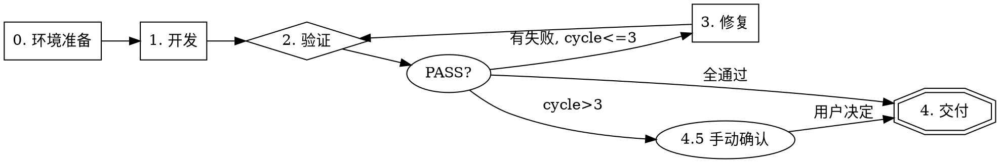

# Dev Loop Skill Design

**Date:** 2026-05-25 **Status:** Draft

## Overview

A skill (`dev-loop`) that orchestrates a closed-loop development workflow: **开发 → 验证 → 修复 → 验证 → 交付**. Uses CDP (Chrome DevTools MCP) for browser observation and WebMCP (`navigator.modelContext`) for app-level actions.

### Trigger

`/dev-loop` or natural language: "实现 X", "修复 Y", "build Z".

### Trigger NOT for

- Bug diagnosis without implementation — use `superpowers:systematic-debugging`
- Code review — use `superpowers:requesting-code-review`
- Pure refactoring — no behavior change, no verification needed
- WebMCP tool registration — use `webmcp-tool-registrar`

## Architecture



## Phase 0 — 环境准备

Runs once at loop entry. Ensures the verification environment is ready.

### Dev Server Detection

1. **Probe:** `curl -s http://localhost:8080` (or configured port). HTTP 200 → already running, skip.
2. **Start if needed:** If probe fails, run `yarn start` (or configured command) in background.
3. **Wait:** Navigate browser to target URL, `wait_for` a known stable selector (e.g., "AI Assistant" or `.sumi-workspace`).
4. **Timeout:** If server doesn't start within 120s, report setup failure.

**Configuration** (`.claude/dev-loop-config.json`, optional):

```json
{
  "startCommand": "yarn start",
  "port": 8080,
  "waitSelector": ".sumi-workspace"
}
```

If absent, defaults: `yarn start`, port 8080, selector `.sumi-workspace`. On first run, confirm with user: "Your start command is X on port Y — correct?"

### WebMCP Availability Check

Runs once in Phase 0 at loop entry. Also checked before each Phase 2 verification (cheap probe).

```javascript
// CDP evaluate_script
if (!navigator.modelContext) {
  return { available: false };
}
const tools = navigator.modelContext.getTools();
return { available: true, toolCount: tools.length, tools: tools.map((t) => t.name) };
```

- **Phase 0 unavailable:** Report **SETUP_FAILURE**, stop. Diagnose: `onDidStart` not fired, service not registered.
- **Mid-loop unavailable:** Report **SETUP_FAILURE**, stop the loop. Do NOT auto-restart Phase 0. Tell user: "WebMCP dropped — likely dev server hot-reload. Refresh the page and re-run `/dev-loop`?"
- **Phase 0 with 0 tools:** Likely `onDidStart` didn't register — check contributions.
- **If available with tools:** Proceed to Phase 1.

## Phase 1 — 开发

### Scenario Lookup

1. **Exact filename match:** User mentions a scenario name (e.g., "用 permission-dialog 场景") → load `test/bdd/permission-dialog.scenario.md`.
2. **List & ask:** If no clear match, list existing scenarios → "Use which? [1/2/3/new]".
3. **Auto-generate:** User selects "new" or can't decide → generate from description, save to `test/bdd/<kebab-case-name>.scenario.md`, present for confirmation before proceeding.

### Contract Design

From the user's description (or loaded scenario), design the contract:

- **Name:** `<module>_<action>` — what it does, not how
- **Input schema:** all parameters needed for complete intent
- **Return value:** result description, not process steps

Present contract to user for confirmation before coding.

**Contract vs Scenario — relationship:**

- **Contract** defines the _interface_: tool name, input parameters, return shape. This is what gets implemented in code (WebMCP `registerTool` or TypeScript function).
- **Scenario** defines the _verification steps_: Given/When/Then that exercise the contract end-to-end in the browser.
- A scenario may exercise one or more contracts. The scenario's "When" steps call contract tools via WebMCP or CDP; the "Then" checks verify the contract's promised behavior.
- Order: design contract → write scenario → implement → verify.

### Implementation

Write code following the contract. Use existing patterns from the codebase. Register WebMCP tools if needed (delegate to `webmcp-tool-registrar` if registration is required).

## Phase 2 — 验证

Delegates to `cdp-verification-scenarios` skill workflow. The dev-loop skill provides:

- Scenario file path (from Phase 1)
- Browser context (from Phase 0)

The verification skill executes:

1. **Read scenario** → Given/When/Then
2. **Execute steps** in order (webmcp, cdp-click, cdp-wait, cdp-evaluate, cdp-snapshot)
3. **Compare vs expected** → explicit PASS/FAIL per scenario
4. **Report** → which scenarios passed, which failed, with evidence

**Critical (delegation contract):** The verification skill must output explicit "PASS: ..." or "FAIL: ..." judgments, not just data dumps. This is a contract between dev-loop and `cdp-verification-scenarios` — dev-loop relies on explicit PASS/FAIL to decide whether to enter Phase 3.

## Phase 3 — 修复 (Auto, Max 3 Cycles)

Only runs if Phase 2 produced FAIL results.

### Per Cycle

1. **Write diagnostic summary** to `test/bdd/.last-failure.md`:

   - Which step failed
   - Expected vs actual
   - Hypothesis for root cause

2. **Launch fix subagent** with:

   - The diagnostic file (`test/bdd/.last-failure.md`)
   - The scenario file
   - Scope hint: `packages/ai-native/` + packages from `git diff --name-only`
   - Permission: read code, run codegraph, edit files

3. **Subagent workflow:**

   - Explore code within bounded scope (codegraph_explore, etc.)
   - Diagnose root cause
   - Fix code
   - Return: root cause hypothesis + files changed

4. **Re-run Phase 2** — only the failing scenarios from this cycle. If all failing scenarios pass, run a **full regression** (all scenarios) before proceeding to Phase 4. If regression introduces new failures, treat as new FAIL and continue the fix cycle.

### Exit Conditions

- **PASS:** All scenarios pass → exit loop, go to Phase 4.
- **3 cycles exhausted with failures:** Stop. Show all failures with diagnostics. Ask user for direction.
- **Never retry without a code change** between attempts.

### Context Management

Main session stays lean — it only holds the loop state (cycle count, pass/fail summary). Each fix cycle's detailed context lives in the subagent, which is discarded after completion.

## Phase 4 — 交付

No git action. No auto-commit.

Show summary:

- Scenarios run: N
- Passed: X, Failed: Y
- Files changed: list
- Fix cycles used: M/3
- Any remaining issues

Stop. User decides next action (commit, PR, more changes).

## Scenario File Format

All scenarios live in `test/bdd/`. Format:

```markdown
# Scenario: <short description>

## Given

- Browser is at http://localhost:8080
- WebMCP is available (`navigator.modelContext` exists)

## When

1. `webmcp`: acp_showChatView
2. `webmcp`: acp_createSession → capture sessionId
3. `cdp-wait`: "AI Assistant" visible
4. `webmcp`: acp_sendMessage({ sessionId, message: "test" })

## Then

- Step 3 result: "AI Assistant" appears in snapshot
- User message "test" appears in chat view
```

**Step types:** `webmcp`, `cdp-click`, `cdp-wait`, `cdp-evaluate`, `cdp-snapshot`

## Skill Consolid

Three changes to existing skills:

### 1. Delete `cdp-webmcp-bridge`

Move its content into `cdp-verification-scenarios`:

- data-testid reference table → append as "Reference: data-testid" section
- Common failures table → append as "Reference: Troubleshooting" section
- Verification patterns table (State→UI, UI→State, Full E2E) → already exists, merge duplicates

**Impact check:** Search the codebase for `cdp-webmcp-bridge` references in other specs or docs. If found, update references before deleting.

### 2. Update `cdp-verification-scenarios`

After absorbing bridge content:

- Scenario file path: change from `docs/superpowers/specs/` to `test/bdd/`
- Add Phase 0 environment check as first step
- Keep the 4-phase workflow unchanged

### 3. Delete `contract-dev`

Merge its concepts into `dev-loop`:

- Contract design rules (意图优先, 参数完整, 结果导向, 可自证) → Phase 1 of dev-loop
- 7-step flow → absorbed by the dev-loop 0-4 phases
- `reference/webmcp-examples.md` → move to `dev-loop/reference/` or delete (redundant with `webmcp-tool-registrar/CODE-PATTERNS.md`)

**Impact check:** If `/contract-dev` has been used as a direct trigger, users will see "skill not found." Before deleting, add a one-line stub at the old path: "This skill has been merged into `dev-loop`. Use `/dev-loop` instead."

### 4. Keep `webmcp-tool-registrar`

Unchanged. Separate concern (tool registration, not development loop).

## File Structure After Changes

```
.claude/
  skills/
    dev-loop/
      SKILL.md                      # orchestrator, all phases
      reference/
        webmcp-examples.md          # (moved from contract-dev/)
    cdp-verification-scenarios/
      SKILL.md                      # + data-testid table, + troubleshooting
    webmcp-tool-registrar/          # unchanged
      SKILL.md
      INIT-FLOW.md
      CODE-PATTERNS.md
      EVALS.md
    cdp-webmcp-bridge/              # DELETED
    contract-dev/                   # DELETED
  dev-loop-config.json              # (optional, dev server config)

test/
  bdd/                              # all BDD scenarios
    <feature>.scenario.md
    .last-failure.md                # (ephemeral, fix cycle diagnostic)
```

## Migration

1. Move existing scenario files from `docs/superpowers/specs/` to `test/bdd/`
2. Update `cdp-verification-scenarios` SKILL.md to reference `test/bdd/`
3. Merge bridge content into verification scenarios
4. Delete `cdp-webmcp-bridge/` and `contract-dev/`
5. Create `dev-loop/SKILL.md`
